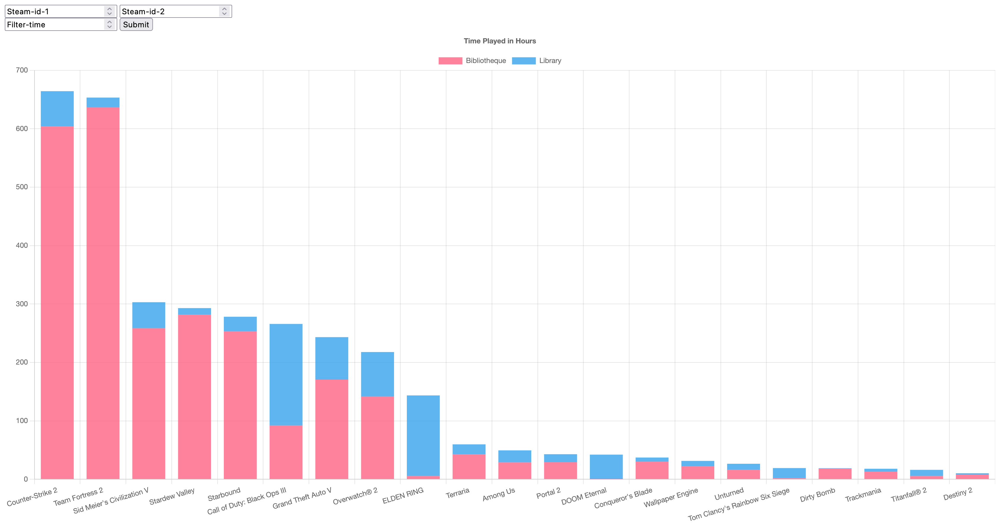

# Compare-Steam-Games

Author: Arlo Filley
## Overview

Compare Steam Games is a web application that allows users to compare the playtime of shared games between two Steam users. The application consists of a Rust-based backend that communicates with the Steam API and a front-end web page for user interaction and data visualization.

### Features

- Input Steam IDs of two users and a filter time.
- Retrieve shared games and playtime data from the Steam API.
- Display the data as a stacked bar chart using Chart.js.
- Easily compare playtimes for shared games between two users.

## Technologies Used

- Rust: The backend of the application is built using Rust and the Rocket web framework.
- JavaScript: The front-end of the application is powered by JavaScript, which makes API requests and handles data visualization.
- HTML/CSS: The user interface is created using HTML and styled with CSS.
- Chart.js: Chart.js is used to create the stacked bar chart for displaying playtime data.

## Setup

To set up and run this project locally, follow these steps:

1. Clone the repository to your local machine:

```bash
    git clone <repository-url>
```

2. Navigate to the project directory:

```bash
    cd Compare-Steam-Games
```

3. Start the Rust server:

```bash
cargo run --release -- --api-key YOUR_STEAM_API_KEY
```

4. Open the index.html file in your web browser to access the web interface. By default located at http://127.0.0.1:8000/public/

## Usage

Open the web page in your browser after starting the server.

Enter the Steam IDs of two users and specify a filter time in minutes.

Click the "Submit" button to compare shared game playtimes.

The results will be displayed as a stacked bar chart, showing playtime for shared games between the two users.

## Screenshots



## Contributing

Contributions to this project are welcome. If you would like to contribute, please follow the standard GitHub workflow:

1. Fork the repository.
2. Create a new branch for your feature or bug fix.
3. Make your changes and test thoroughly.
4. Create a pull request with a clear description of your changes.
5. Your pull request will be reviewed, and your changes may be merged into the main branch.

## License

This project is licensed under the MIT License - see the LICENSE.md file for details.

## Acknowledgments

- Rocket: The Rocket web framework for Rust.
- Chart.js: Chart.js library for data visualization.
- Steam API: Steam Web API for retrieving user and game data.

## Contact
For questions or inquiries about this project, please contact the author:

Arlo Filley
Email: arlo@example.com
GitHub: github.com/arlofilley